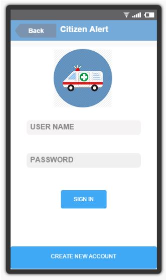
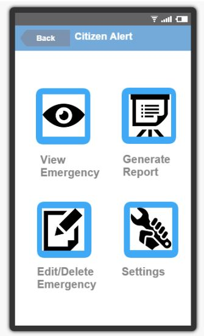
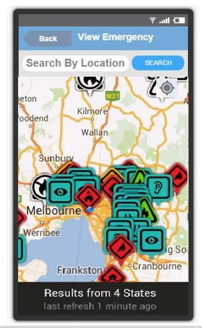
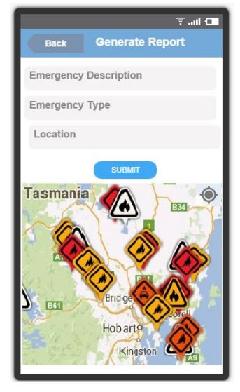
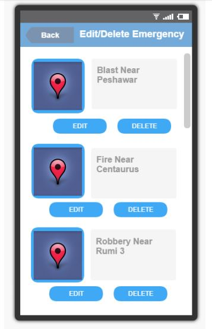

# CitizenAlert
An android application built using Google maps API and Rest API to alert people where an emergency has happened

Citizen Alert is an online android based emergency reporting application that allows users to
report an emergency such as fire, health emergency and crime online. Unfortunately, due to
lack of technical expertise, lack of experience, incompetence of rescue agencies and low level
corruption, such emergencies are not properly reported and sometimes are left completely
untold. Essentially, the purpose of the project is to help members of society report incidents as
well as be aware of what is happening in their surroundings. By using the application, people
can know what areas to avoid, or where they can help. Rescue services, police and fire
departments can be informed about incidents immediately along with the exact location
ensuring quick and efficient response.

The locations pin-pointed on the map would be shown as custom markers having different
colors to uniquely identify the type of activity being carried out. Green markers for health
emergencies, red markers for fire emergencies and blue markers for crime related activities. 

1 USER LOGIN SCREEN
User sees login screen as soon as he starts the application. A create new account option is also given in
the bottom incase a new user wants to register to the application.

2 MAIN MENU PAGE
User sees a main menu page when he logs into the application. 4 options are provided to the users,
which are to view emergencies & events, generate an emergency report, update/delete an emergency
report and the settings options to turn on/off auto location option

3 VIEW EMERGENCY
When user selects the “view emergency” option, he’s taken to another screen where a google map is
shown with markers indicating recent events/emergencies. The user can also filter the emergencies
according to location. 

4 GENERATE EMERGENCY REPORT
When user selects the “generate report” option, he’s taken to another screen where he has to fill in the
desired text boxes, giving a brief description of the emergency, choosing the type of emergency and
adding the location where the event occurred. After user submits, a marker will be placed at the desired
location in the google map shown below. 

5 EDIT/DELETE EMERGENCY
When user selects the “Edit/Delete Emergency” option, he’s taken to another screen where the user can
view all his generated emergencies. The user can therefore update or delete an emergency accordingly. 

Database Schema For Help :

How To Run:

Import the project in eclipse or android studio.
for sql connection you have to set the name of you webhost, database username and password
in response.php you have to set the database required information
put response the php file on your webhost for doing communication between the android application and database 

file info:

a3785520_mydb.sql is the file for creating the dummy database that will be later used for storing and retrieving data
response.php is the file that handle the requests comming from the android application and returns the response.

Note: For request from and response to android application we have used Volley library. 

